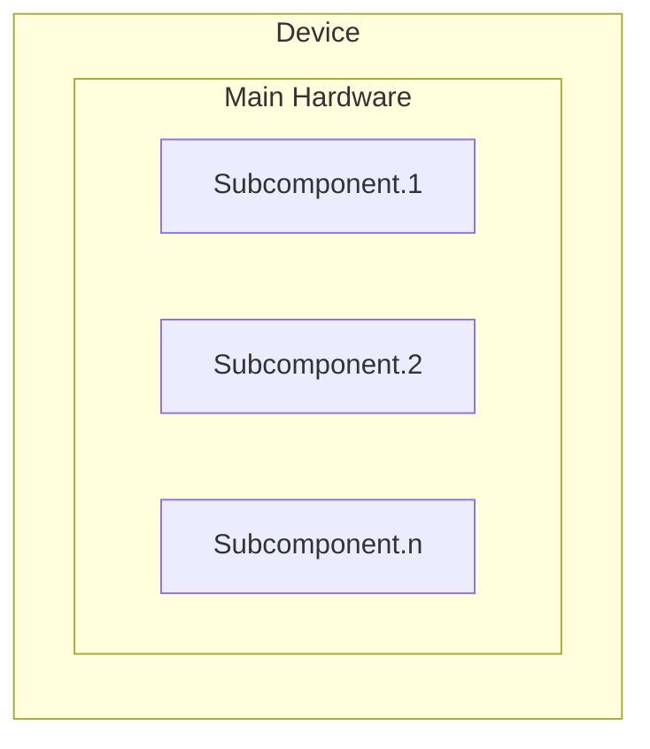

<!--- 
    SPDX-FileCopyrightText: 2022 Siemens AG
    SPDX-License-Identifier: MIT 
-->

# SICAM GridEdge Configurationtemplates
`sicam-gridedge-configurationtemplates` is a collection of templates which can be used in [SICAM GridEdge](https://mall.industry.siemens.com/mall/de/de/Catalog/Products/10387244) product in order to collect data (measurements/asset information data) and publish the data to a cloud system.

The collection does not claim to be complete, but will provide you a way to easily enhance the information you need in your SICAM GridEdge environment.

This guide contains following steps:
* [Creating device templates for Asset Data Collection](#creating-device-templates-for-asset-data-collection-snmp-client-wmi-client)
* [Creating device templates for data collection using Modbus Protocol](#creating-device-templates-for-data-collection-using-modbus-protocol)
* [Creating device templates for data collection using IEC61850 Protocol](#creating-device-templates-for-data-collection-using-iec61850-protocol)


## Usage of device templates in SICAM GridEdge
1. Download the requirement Device Templates for your station
1. Modify the device templates according to your needs
1. Import the device templates using SICAM GridEdge Webinterface

# Creating device templates for Asset Data Collection (SNMP Client/ WMI Client)
A device template contains all information for reading individual data from the device and map them to the Asset Information File structure of SICAM GridEdge. The created Asset Information file can later on be viewed in SICAM GridEdge itself or will be uploaded to a configured cloud system.

## Device Template CSV definition
In order to define a device template that can be used in SICAM GridEdge, it is required to create a CSV file in a predefined format. The file contains the following columns that are seperated by semicolon ";"

| Column Name  | Description |
| ----------- | ----------- |
| Name      | Attribute name which is used for your reference. This information will not be published to resulting Asset Information File |
| Address   | Address of the information to be read. For SNMP this will be the OID address of the attribute. You can find the OID address either in the MIB file provided by the hardware vendor, or by traversing all information available of a specific device by a third party tool. For WMI this is the WMIC query that will be used to retrieve the information (refer to https://docs.microsoft.com/en-us/windows/win32/wmisdk/wmic ) If no Address is defined, or the reading of the defined Address does not work, the “Default Value” will be used. |
| Type | Type used to define the number of values fetched from the device. Single: A single value is fetched from the address given. Multiple: Multiple values are fechted from the Address given. |
| Default value | Value used as the default value of the device attribute if no information is available at the given address or if the result of reading information is empty | 
| Mapping | Target location where the attribute value will be located in the SICAM GridEdge asset information file structure (refer to [Asset Information File Structure](#asset-information-file-structure) |

Example for a Template file
```
Name;Address;Type;DefaultValue;Mapping
VendorName;1.3.6.1.2.1.1.1.0;Single;Meinberg;VendorName
DeviceName;1.3.6.1.2.1.1.5.0;Single;M100;HwProduct.0/ProdCompName
Location;1.3.6.1.2.1.1.6.0;Single;;LocationName
HardwareId;;Single;;AssetUuid
DeviceFamily;;Single;Meinberg;DeviceFamily
DeviceModel;1.3.6.1.2.1.1.1.0;Single;M100;DeviceModel
SerialNumber;1.3.6.1.4.1.5597.30.0.0.3.0;Single;;HwProduct.0/ProdCompSerialNumber
HwVersion;1.3.6.1.4.1.5597.30.0.0.5.0;Single;;HwProduct.0/ProdCompVersion
FwVersion;1.3.6.1.4.1.5597.30.0.0.2.0;Single;;FwSwComponent.0/ProdCompVersion
FwName;;Single;Device Firmware;FwSwComponent.0/ProdCompName
FwDescription;;Single;Device Firmware;FwSwComponent.0/ProdCompDescription
```

## Asset Information File Structure
The Asset Information files which are created by SICAM GridEdge are based on the following hierarchical model of a device.



### Object `Device`
The device object contains a global description of the device by using different attributes. It is mandatory for a Template.
| Column Name  | Description |
| ----------- | ----------- |
| VendorName	 | Vendor name for the specific device |
| LocationName | (optional) Name of the location the device is built in |
| DeviceModel |	The device model (for Siemens protection and PQ devices the first five characters of the order number, e.g. 7SJ80, 7SL82.) |
| DeviceFamily | The device family (SIPROTEC, Reyrolle, Ruggedcom, ...), same as before in ProdCompName for "HwProduct" component|

Example for a device description in template file
``` 
Name;Address;Type;DefaultValue;Mapping
Device_VendorName;;Single;Unknown_Vendor;VendorName
Device_Location;1.3.6.1.2.1.1.6.0;Single;;LocationName
Device_Family;;Single;Unknown_DeviceFamily;DeviceFamily
Device_Model;1.3.6.1.4.1.48690.1.2.0;Single;;DeviceModel
```

### Object `Main Hardware`
The hardware object is the main object of all components of a device. It contains the main information for a hardware.

| Attribute |	Description |
| ----------- | ----------- |
| ProdCompName | contains the name of the product or component. |
| ProdDescription |	contains a short description of the product or component. |
| ProdCompOrderNumber | represents the MLFB number of the product or component. |
| ProdCompSerialNumber | represents the serial number of the HW product or component. |
| ProdCompVersion | contains the FW, HW, SW or configuration version number. |
| ProdCompManufactDate | contains the manufacturing date of the HW product or component. |
| ProdCompLastChange | contains the last change date and time of the updateable component. |

Example for a hardware description in template file
``` 
Name;Address;Type;DefaultValue;Mapping
Device_Name;1.3.6.1.2.1.1.5.0;Single;RUT955;HwProduct/ProdCompName
Device_SerialNumber;1.3.6.1.4.1.48690.1.1.0;Single;;HwProduct/ProdCompSerialNumber
Device_OrderNumber;1.3.6.1.4.1.48690.1.3.0;Single;;HwProduct/ProdCompOrderNumber
Device_HardwareRevision;1.3.6.1.4.1.48690.1.5.0;Single;;HwProduct/ProdCompVersion
```

### Object `Subcomponents`
Typically a device consists of several components (e.g. Firmware, Software, Hardwaremodules, ..)

Each of the subcomponents is always related to the [Main Hardware](#object-main-hardware).
In order to distinguish between different components, for a certain subcomponent type there is a index added to the end of the component mapping. (e.g FwSwComponent.0/ProdCompVersion). The index starts with 0 which is the main component all other components of the same product component type have to be sequentially-numbered.

The possible sub component types are:

| Sub Component Type | Description |
| ----------- | ----------- |
| HwProduct	| Describes a sub hw product, index needs to start with 1 |
| FwSwComponent	| Contains Asset Information for a Firmware or Software component |
| [NetworkComponent](#subcomponent-network-component) | Contains Asset Information for a network adapter |

Each component has a set of predefined attributes which can be used. All attributes are optional.

| Product Component Attribute |	Description |
| ----------- | ----------- |
| ProdCompName | contains the name of the product or component. |
| ProdDescription |	contains a short description of the product or component. |
| ProdCompOrderNumber | represents the MLFB number of the product or component. |
| ProdCompSerialNumber | represents the serial number of the HW product or component. |
| ProdCompVersion | contains the FW, HW, SW or configuration version number. |
| ProdCompHwSlot | represents the number or name of the slot where the HW component is plugged-in. |
| ProdCompManufactDate | contains the manufacturing date of the HW product or component. |
| ProdCompLastChange | contains the last change date and time of the updateable component. |

An example usage:
``` 
Name;Address;Type;DefaultValue;Mapping
#General Description of Device
System_Name;;Single;System;FwSwComponent.0/ProdCompName
System_FWVersion;1.3.6.1.4.1.48690.1.6.0;Single;;FwSwComponent.0/ProdCompVersion
Modem_Name;1.3.6.1.4.1.48690.2.2.1.4.1;Single;;FwSwComponent.1/ProdCompName
Modem_Description;;Single;Modem;FwSwComponent.1/ProdCompDescription
Modem_FW_Version;1.3.6.1.4.1.48690.2.2.1.6.1;Single;;FwSwComponent.1/ProdCompVersion
Modem_IMEI;1.3.6.1.4.1.48690.2.2.1.3.1;Single;;FwSwComponent.1/ProdCompSerialNumber
``` 

#### Subcomponent `Network Component`
For definition of a network adapter it is possible to used following attributes additionally to the ones defined above.

| Product Component Attribute |	Description |
| ----------- | ----------- |
| ProdNetworkCompMACAddr |	The MAC Address of the Network Adapter |
| ProdNetworkCompIPAddr	| The IP Address of the Network adapter | 
| ProdNetworkCompNetMask | The Subnet Mask of the Network adapter |

An example usage:
``` 
MacAddress;1.3.6.1.2.1.17.1.1.0;Single;;NetworkComponent.0/ProdNetworkCompMACAddr
IPAddress;1.3.6.1.2.1.17.1.1.2;Single;; NetworkComponent.0/ProdNetworkCompIPAddr
SubnetMask;1.3.6.1.2.1.17.1.1.3;Single;;NetworkComponent.0/ProdNetworkCompNetMask
``` 

# Creating device templates for data collection using Modbus Protocol
Device Template allows you to communicate to any Modbus device from the SICAM GridEdge. A device
template contains all required mapping information for reading individual data from the Modbus device and
converts them to data points that can be sent to the cloud service.
The template file is a CSV file with the following CSV definitions:
* Column delimiter is a semicolon (“;”)
* Decimal delimiter for floating-point number is a dot (“.”)
* Rows that start with a hash character (“#”) are interpreted as comments and are ignored

Example:
``` 
# Siemens SICAM Q100: Class A Power Quality Instrument and Power Monitoring
Device
#
DataObjectName;Activated;RegisterType;RegisterNumber;DataType;Unit;DataFormatOnB
us;BitOffset;ScalingFactor;ScalingOffset
#
# Device Status Indications
Device_OK;1;Holding;101;Indication;;1Bit;0;
Battery_failure;1;Holding;101;Indication;;1Bit;2;
#
# Measured Values (Instantaneous Values)
Va;1;Holding;201;MV;V;Float32;;1;0
Vb;1;Holding;203;MV;V;Float32;;1;0
Vc;1;Holding;205;MV;V;Float32;;1;0
VN;0;Holding;207;MV;V;Float32;;1;0
``` 

In the example, the mappings for six data points, 2 indications and 4 measured values are described. However,
only 3 of the measured values will be requested from the Modbus device because the data object “VN” is
configured to be not activated.

| Column Name  | Range | Description |
| ----------- | ----------- | ----------- |
| DataObjectName | String, min. 1 and max. 128 characters, All characters are allowed including slash (/) and backslash (\)., Data object names must be unique within a Modbus device., Data object name cannot start with a slash or a backslash, Data object name cannot end with a slash or a backslash, Slash and backslash characters represent a hierarchy, The data object name includes a maximum of 2 hierarchy parts, e.g., hierarchyPart1/hierarchyPart2/dataObjectName| Name of a data object that shall be read via Modbus |
| Activated | 0 or false: no, other than 0 or true: yes | Determines whether the data object shall be read by Modbus, evaluated, and transmitted to the cloud platform. The entries in the device template can contain the full amount of data that are offered from the device but not all might be of interest for further processing |
| RegisterType | One of the following strings (not case sensitive): CoilStatus or Coils or 0, InputStatus or DiscreteInputs or 1, Input or InputRegisters or 3, Holding or HoldingRegisters or 4 | Register type to read from |
| RegisterNumber | 1 to 65535 | Start register number of the data object in the register type |
| DataType | One of the following strings (not case sensitive): SPS or Indication, MV, Counter, Border | Type of the data object that corresponds to type to the cloud platform. For more information on the data type Border, see below. |
| Unit | A Measuring Unit string, e.g. V, A, kV, degC, %H, hPa (max. 64 characters) | Measuring Unit, for measured values and counters only, for transmission to the cloud DataFormatOnBus Refer to Data Formats on Bus Page 57 | Format of transmitting the dataobject via Modbus |
| BitOffset | 0 to 15 | Only for indications transmitted in an input or holding register. Offset of the indication in this register |
| ScalingFactor | Any floating-point value | Factor with which the read value from Modbus is multiplied before transmitting to the cloud platform |
| ScalingOffset | Any floating-point value | Numeric value with which the read value from Modbus is added before transmitting to the cloud platform |

For measured values and counters the resulting value is calculated by: ResultingValue = (ReadValue * ScalingFactor) + ScalingOffset

Data type **Border**: In case the Modbus client requests data from a Modbus server device that are in the same register but do not follow each other directly, the Modbus client reads not needed data between the requested registers.The aim is to optimize request calls.

Example: The Modbus client requests an Int16 MV1 from the holding register 101 as well as an Int16 MV2 from the holding register 109. In this case, one request telegram is sent requesting all registers from 101 to 109. However, only the registers 101 and 109 for the MV1 and MV2 are evaluated.

Depending on the implementation in the Modbus server and the data mapping for the device, this could lead to a Modbus exception response as the registers between the requested ones cannot be mapped. In this case, a Border entry has to be included in the device template so that the requests are split in 2 separate telegrams. After the mapping entry for MV1, a line must be entered. This results in one request being sent for MV1 and one request being sent for MV2.

``` 
Border1;1;Holding;102;Border;;;;;
``` 

## Data Formats on Bus
Data from Modbus devices with the following Data Formats on Bus can be interpreted by the Modbus Client in GridEdge:

| DataTypeOnBus |  Data Format Description  | Range | Invalid Sign | Used Modbus Registers | Data Type in Cloud |
| ----------- | ----------- | ----------- |----------- |----------- |----------- |
| Uint1 6 | 16-bit unsigned integer | 0 to +65535 | no | 1 (Input or Holding register) | Measured value, Timeseries |
| Int32 | 32-bit signed integer, Big endian | -2147483648 to 2147483647 | no | 2 (Input or Holding register) | Measured value or Counter, Timeseries |
| Int32_LE  | 32-bit signed integer, Little endian | -2147483648 to 2147483647 | no | 2 (Input or Holding register) | Measured value or Counter, Timeseries |
| UInt32 | 32-bit unsigned integer, Big endian | 0 to +4294967295 | no | 2 (Input or Holding register) | Measured value or Counter, Timeseries |
| UInt32_LE | 32-bit unsigned integer, Little endian | 0 to +4294967295 | no | 2 (Input or Holding register) | Measured value or Counter, Timeseries |


# Creating device templates for data collection using IEC61850 Protocol
By using an data-point selection and mapping template for IEC61850 it is possible to explicitly define a range of datapoints which shall be fetched by IEC61850. This is done using a CSV file.
For some devices it is also needed to map a specific datapoint to another IEC61850 object structure. E.g. If you consider to view wear monitoring data from SIPROTEC4 devices in SIPROTEC Dashboard with data modeled with a GGIO structure, it is necessary to apply a mapping. 


> **NOTE**
> 
> For SIPROTEC 4 devices you can find an example mapping file in the setup bundle: examples/SIPROTEC_Dashboard/IEC61850_Mapping_SIP4_WearMonitoring.csv.

In order to define a data mapping that can be used in SICAM GridEdge, it is required to create a CSV file in a predefined format. The file contains the IED names where the mapping is to be applied to (column **IedName**), the data model as defined in the device (**Source**) and the desired data model that is used for publishing the data to the cloud (**Replacement**). The columns in the CSV file are separated by semicolon ";". 

> **NOTE**
> 
> In the CSV file it is possible to configure Data Mapping and Data Selection. 

Example CSV File
``` 
IedName;Source;Replacement
IED_000.*;EXT/pdGGIO2001$ST$ISCSO1;CB1_CBWearMonitoring/PIx_SCBR1$ST$SumIxA
IED_00000[1-9];EXT/pdGGIO2001$ST$ISCSO3;CB1_CBWearMonitoring/PIx_SCBR1$ST$SumIxC
``` 

In the example above
* the data point with the name EXT/pdGGIO2001$ST$ISCSO1 of the devices whose IED name starts with "IED_000" will be mapped to CB1_CBWearMonitoring/PIx_SCBR1$ST$SumIxA and selected for being transferred to SICAM GridEdge, 
* the data point with the name EXT/pdGGIO2001$ST$ISCSO3 of the devices with IED name IED_000001 to IED_000009 will be mapped to CB1_CBWearMonitoring/PIx_SCBR1$ST$SumIxC and selected for being transferred to SICAM GridEdge.

> **NOTE**
> 
> Data points may only be mapped on the IEC 61850 Data Object level. Therefore, always use a mapping in the following format: 
> {Logical Device Instance}/{Logical Node Name Prefix}{Logical Node Class}{Logical Node Name Suffix}$ {Functional Class Name}${Data Object Name}

> **NOTE**
> 
> By using regular expressions, which is allowed for the column IedName, it is also possible to select a specific subset of IedDevices, e.g. “IED_00000[1-9]” would select the devices IED_000001, IED_000002, ... IED_000009 for mapping.

If you do not use a Replacement string data will be forwarded with the same IEC Object Structure that was defined in the Source string.


# Contributions
Contributions are always welcome! Please see [CONTRIBUTING.md](CONTRIBUTING.md) for details.

# License

This project use the following license: [MIT](LICENSE.md)

Copyright 2022 Siemens AG
